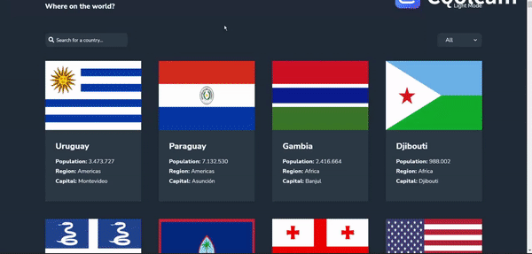

# Frontend Mentor - REST Countries API with color theme switcher
 
## Welcome 🍃

This project challenged by Frontend Mentor was an excellent project to put my SCSS, DOM skills, and API handles into practice. The project is about consuming a countries API, making some countries' filters, see more detailed information about the country clicked on a separate page, click through to the border countries on the detail page and toggle colour sheme 

## Links
- My Linkedin [Linkedin](https://www.linkedin.com/in/mouhametndiaye/)
- My email ahmetndiaye404@gmail.com
- Live Project [REST Countries API](https://mouhametnd-countries-api.netlify.app/)
- Challenged by [Frontend Mentor](https://www.frontendmentor.io/home)

## Challenge  
Users should be able to:

- See all countries from the API on the homepage
- Search for a country using an `input` field
- Filter countries by region
- Click on a country to see more detailed information on a separate page
- Click through to the border countries on the detail page
- Toggle the color scheme between light and dark mode.

## Design of the App

## Built with

- Mobile-first workflow
- Semantic HTML5 markup
- SASS
- Flexbox
- CSS Grid
- fetch
- async functions
- localStorage

  
